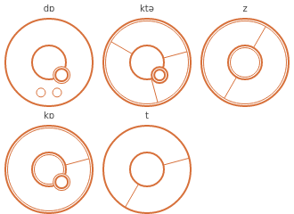

# Gallifreyan Translation Helper
###### by MightyFrong

This is an online tool aimed at artists and hobbyists who produce designs in one of 5 types of Gallifreyan:
* [Sherman's Circular Gallifreyan by Loren Sherman][SCG]
* [TARDIS Console by Purple Emily][TCG]
* [Doctor's Cot by Brittany Goodman][DCG]
* [CC Gallifreyan by gumex][CC]
* [DotScript by Rachel Sutherland][DS]

Some details on what the translation helper for each system does can be found below:
* [Sherman's](#Shermans)
* [TARDIS Console](#TARDIS-Console-WIP)
* [Doctors's Cot](#Doctors-Cot)
* [Doctors's Cot 2.0](#Doctors-Cot-20)
* [CC Gallifreyan](#CC-Gallifreyan)
* [DotScript](#DotScript)

Please recognize this tool ***not*** as a translator: it serves the purpose of quicker impressions of writing syntax. The artistic composition is, and should be, your challenge. Please do not use any of these outputs for an immediate tattoo template!

---

## Abstract

See the [wiki](https://github.com/Mightyfrong/gallifreyan-translation-helper/wiki) for a high-level overview of the project. The rest of this documentation is planned to follow.

(All of) the supported systems generate an svg-output that can be saved by right-clicking and are hopefully useful to initiate artistic work within your vector-graphics-application.

## Sherman's

Primarily designed as a pattern memory aid, this module draws each character either as an individual glyph, or stacked depending on choice. It displays the words either in a circular fashion (not spiral though) or every glyph/group in horizontal lines for ease of reading.

One can optionally toggle whether C is transcribed to K/S in the language controls.

Numbers are supported, but only make sense with grouping enabled. Dot and comma both are valid decimal separators in number groups.

Diacritics are supported according to the [official guide][SCG] for german umlauts, accent acute, accent grave, ñ and scandinavian å, ø and æ.

Decorator lines do not connect anywhere at the moment. This is as well due to the fact we did not come up with a reasonable algorithm to accomplish that yet, as random straight lines are neither easy to read nor aesthetically appealing.

### What To Expect


### Test Input
`The quick brown fox jumps over the lazy dog.`

`Falsches Üben von Xylophonmusik quält jeden größeren Zwerg.`

`Voyez le brick géant que j'examine près du wharf.`

`El pingüino Wenceslao hizo kilómetros bajo exhaustiva lluvia y frío; añoraba a su querido cachorro.`

`Flygande bäckasiner söka hwila på mjuka tuvor.`

---

## TARDIS Console (WIP)

Due to the detail in TARDIS Console glyphs, a look-up table of some sort of drawing instructions is needed for each individual letter. The format we chose was [SVG path data][1], which can be parsed by the `CanvasRenderContext2D.prototype.stroke()` and `.fill()` methods.

Because glyphs consist of a mixture of filled shapes and different line thicknesses, one set path data was insufficient for each letter. 3 line thicknesses were identified, and so each glyph is described by 4 sets of path data, the first being filled shapes. A semi-colon was chosen to separate the path strings, so the code which processes them looks like this:

```js
function drawGlyph(ctx, pathString) {
	pathString.split(";")              
		.forEach((str, idx) => { 
			const path = new Path2D(str);

			if (idx) {
				ctx.lineWidth = idx;
				ctx.stroke(path);
			} else
				ctx.fill(path);
		});
}
```

### Test Input

For checking that TARDIS Console vowel rendering works.

```
babebibobu
cacecicocu
chachechichochu
dadedidodu
fafefifofu
gagegigoguhahehihohu
jajejijoju
kakekikoku
lalelilolu
mamemimomu
naneninonu
papepipopu
qaqeqiqoqu
ngangengingongu
quaquequiquoquu
rareriroru
sasesisosu
shasheshishoshu
tatetitotu
thathethithothu
vavevivovu
wawewiwowu
xaxexixoxu
yayeyiyoyu
zazezizozu
phaphephiphophu
```

---

## Doctor's Cot

This one is the most complicated of the 3 languages as it transcribes the exact phonetics of words instead of just their letters. Hence, the user is given an on-screen IPA ([International Phonetic Alphabet][2]) keyboard.

### Example


---

## Doctor's Cot 2.0

The progress of vectorizing all the things got a bit stuck for a few weeks and one of us wasn't able to understand and contribute to foreign code. So Doctor's Cot was straightforwand rebuild based on the coding style of CC-Gallifreyan. ɑ-based vowels are a bit impure regarding connectivity, but on the plus side there is canonical punctuation (except start indication).
Like in the original Cot-module there is an IPA-keyboard. Since the author has published a simplyfied english version as well there is a respective keyboard that translates the english characters to the IPA-characters according to the official tables.

### Example


---

## CC Gallifreyan

This writing system feels like a hybrid from the look of TARDIS Console and the clear base-decorator-relations from Sherman's. This system processes the latin alphabet with th and ng only, no diacritics, punctuation or numbers.

Characters are simply stacked, while being read from outside to the center, but its up to the artist to decide about the number of stacked characters. This translation helper splits characters in words evenly to the set number. The maximum stacking amount is limited for easier reading, although the writing system itself is not clearly restricted in this context. Base- and decorator-graphics are tilted slightly to make it look less monotonous, yet oriented to one side to avoid problems from overlapping.

### What to expect


---

## DotScript

This writing system may be not widely used but is quite easy and was quick and fun to program. Each character is assigned one of five geometric shapes that have a special placement regarding the base line for consonants and a smaller representation for vowels. The character `z` has it's own form. This system of a distinct glyph for every character makes DotScript more of a font than a writing system. But implementing it was a useful experience.

### What To Expect


---

## Copyright & Licence Notice

Copyright 2020 [Mightyfrong][MF], [erroronline1][EOL1], [ModisR][MR]
 
This file is part of the Gallifreyan Translation Helper,
henceforth referred to as "the GTH".

The GTH is free software: you can redistribute it and/or modify
it under the terms of the GNU General Public License as published by
the Free Software Foundation, either version 3 of the License, or
(at your option) any later version.

The GTH is distributed in the hope that it will be useful,
but WITHOUT ANY WARRANTY; without even the implied warranty of
MERCHANTABILITY or FITNESS FOR A PARTICULAR PURPOSE.  See the
GNU General Public License for more details.

You should have received a copy of the GNU General Public License
along with the GTH.  If not, see <https://www.gnu.org/licenses/>.

[MF]: https://github.com/Mightyfrong
[EOL1]: https://github.com/erroronline1
[MR]: https://github.com/ModisR

[SCG]: https://shermansplanet.com/gallifreyan/guide.pdf
[TCG]: https://tardisconsolegallifreyan.weebly.com/tutorials.html
[DCG]: https://doctorscotgallifreyan.com/walk-through/4lnekzojej4p5klcph0ppntibb19ib
[CC]: https://www.deviantart.com/gumex/art/CC-Gallifreyan-458112363
[DS]: https://www.deviantart.com/rachelsutherland/gallery/58931409/dotscript-gallifreyan-guide

[1]: https://developer.mozilla.org/en-US/docs/Web/SVG/Tutorial/Paths
[2]: https://en.wikipedia.org/wiki/International_Phonetic_Alphabet
