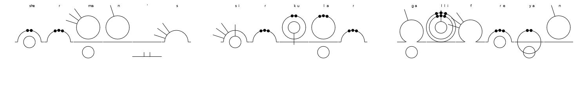
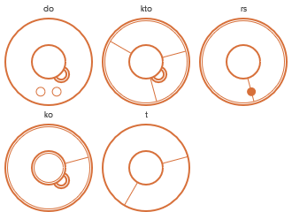
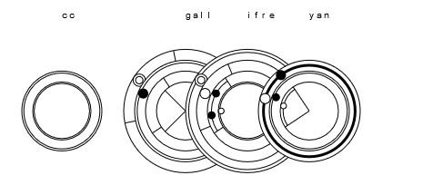
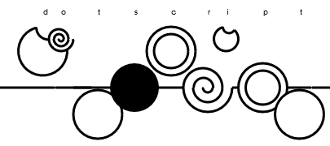

# Gallifreyan Translation Helper
###### by MightyFrong

This is an online tool aimed at artists and hobbyists who produce designs in one of 5 types of Gallifreyan:

* [Sherman's Circular Gallifreyan by Loren Sherman][SCG]
* [TARDIS Console by Purple Emily][TCG]
* [Doctor's Cot by Brittany Goodman][DCG]
* [CC Gallifreyan by gumex][CC]
* [DotScript by Rachel Sutherland][DS]

More details on what the translators for each system does can be found below:
* [Sherman's](#Shermans)
* [TARDIS Console](#TARDIS-Console-WIP)
* [Doctors's Cot](#Doctors-Cot)
* [CC Gallifreyan](#CC-Gallifreyan)
* [DotScript](#DotScript)

---

## Sherman's

Designed as a pattern memory aid, this translator draws each character either as an individual glyph, or stacked depending on choice. It displays the glyphs in horizontal lines instead of writing them in the expected circular fashion for ease of reading.

One can optionally toggle whether C is transcribed to K/S in the language controls.

Numbers are supported, but only make sense with grouping enabled. Dot and comma both are valid decimal separators in number groups.

Diacritics are supported according to the [official guide][SCG] for german umlauts, accent acute, accent grave, ñ and scandinavian å, ø and æ.

### What To Expect


### Recurring Variables Within Global Scope
* cLetter: false by default, true if detected. if true a warning is displayed and drawings are red.
* qLetter: false by default, true if detected. if true a warning is displayed and drawings are red.
* consonant: initial radius for consonants, most important if not only value for resizing the whole output
* vowel: initial radius for vowels
* width: width of the output canvas
* height: height of the output canvas
* x: current x coordinate for drawing, representing the left starting coordinate
* y: current y coordinate for drawing, representing the words baseline
* letterwidth: width of letters/groups
* letterheight: height of letters/groups


### Construction Dictionaries
Sherman's follows a quite easy pattern consisting of big and small circles, arcs, dots and lines all arranged in a clear fashion following plain rules. Like in the original guidance table consonants are grouped to their respective base (b,j,t,th), also vowels with base e (for e,i,u), a and o, punctuation and numbers.
On stacking characters every base has its own center and positioning of elements to its arc, relative to the base center, therefore every base has its specific properties and methods to return the specific relative placements.
To determine the characters base the **shermansBase**-Object has a method to return the correct base.

```js
let shermansBase = {
	scgtable: {
		punctuation: {
			contains: [".", "?", "!", "\"", "'", "-", ",", ";", ":"],
			centerYoffset: consonant * 1.25
		},
		/*...*/
		th: {
			contains: ["th", "gh", "y", "z", "q", "qu", "x", "ng"],
			centerYoffset: 0,
			radialPlacement: function (radiant = Math.PI * .25, item = "vo") {
				let options = {
					ve: { x: 0,	y: 0 },
					va: { x: 0,	y: vowel * 1.75	},
					vo: {
						x: consonant * Math.cos(radiant),
						y: -consonant * Math.sin(radiant)
					}
				}
				if (!(item in options)) item = "vo";
				return options[item];
			}
		}
	},
	getBase: function (char) {
		let rtrn = false;
		Object.keys(this.scgtable).forEach(row => {
			if (this.scgtable[row].contains.Contains(char)) rtrn = row;
		});
		return rtrn;
	}
}
```

The decorator object **shermansDeco** has a comparable pattern. It returns an array of decorators (e.g. diacritics *and* u-line for ü). Decorators can be sets of multiple radiants to be processed and given relative positions or ranges of relative diameters of the parent character circle/arc.

### Translation
**shermansTranslate(ctx, input)** is the main wrapper for the algorithm and is passed the canvas object and the actual input. It sets up the initial coordinates for the words baseline, initiates the [general draw object](#Multipurpose-Drawing), sets up an [array of characters](#Grouping-SCG) and sets the canvas size according to the number of (grouped) characters.

Then the array of characters is processed for each word and each group of characters.
Grouping of characters makes resizing of the base necessary. The index for the last consonant of the group is determined and used as a resizing factor.
In case of numbers a bigger line thickness indicates the end of the number or the decimal point so it has to be checked if it applies to the current character.
The positioning offsets for drawing of the current character in relation to the former is set and the [character is drawn](#Character-Drawing).

Sherman's takes the phonetical [k or s instead of c](#Replacements). C and single q are "allowed" in names only so there is a reminder thrown if these characters are detected.

### Replacements
**replacements(word)** returns the full word after converting c to k or s depending on position, following vowel, or reduced ck, if selected. ß is always replaced with ss.

### Grouping (SCG)
**shermansGrouped.groups(input)** returns a multidimensional array of grouped characters. It initiates the sentence array and loops through the whitespace-splitted input.
The word group is initiated and the word optionally converted in regards of [c-handling](#Replacements).
The following loop iterates over each character of the word, sets the current character, occasionally overrides single characters to double ones (like th, gh, ng, etc.) and corrects the index in this case.

If grouping is active the current characters is added to the former group if
* there is a former group and
* it's a vowel and the former isn't a vowel or number, or the same vowel or
* it's a consonant with the same base as the former character or
* it's a number and the former one is too a decimal- or a minus-sign

Otherwise the current character is added to the recent group.

If the current word is a number there are control characters added to the end of the word that will add the last thick circle or the minus sign for negative numbers. control characters will not show up on the top translations but may be drawn out of context. *The official guide has no recommendations for / and \ . Shown drawings of these characters in a single position do not represent these.*

The group is then pushed to the last word.

**shermansGrouped.resetOffset(lastStackedConsonantIndex)** resets all positioning offsets and resizing factors. The lastStackedConsonantIndex sets the initial resizing factor for the first drawn consonant. Stacked consonants are bigger and will shrink down to default size.

**shermansGrouped.setOffset(former, actual)** sets the resizing, linewidth and positioning offsets fetching the respective values for offsets from the methods and properties of the parent base.

It also sets the carriage return to true to have the characters drawn at the same x-position on the canvas.

### Character Drawing
**shermansDraw(ctx, letter, grouped, thicknumberline)** actually draws a character to the canvas. X and y coordiantes are set. If not grouped the x-"pointer" is set to the next characters position, if the end of the viewport is reached the next line is set. Stroke- and fill-styles are set.

Actual drawing instructions start with the decision about the base.
If it is punctuation the words base line and sentences base line is drawn and the instructions for the actual letter are processed eg...
```js
case "?": /*base "punctuation"*/
	draw.dot(x + 17.5 * shermansScale, y + 15 * shermansScale, 5 * shermansScale);
	draw.dot(x + 32.5 * shermansScale, y + 15 * shermansScale, 5 * shermansScale);
	break;
```
...unless [thicknumberline](#Translation) is set. Then the current "," is supposed to be the decimal sign that is of course not to be displayed as an actual "," but a thick line within the number-group.

Vowels and consonants have the base line drawn unless they are grouped. Then follow the drawing instructions for the base/body of the character:
```js
if (["ve", "va", "vo"].Contains(currentbase)) {
	if (!grouped.carriagereturn) draw.line(x, y, x + letterwidth, y);
	draw.circle(x + center.x, y + center.y, vowel * grouped.vresize);
}
```
...and so on.

Next are the decorators, that iterate through the list of decorators for the current character, iterate through the decorators radiants and apply the drawing instruction considering the relative positioning to the center of the bases body and bases radius:
```js
decorators.forEach(deco => {
	/*e.g. line decorators*/
	shermansDeco.scgtable[deco].radiants.forEach(rad => {
		let fromto = shermansDeco.scgtable[deco].fromto;
		draw.line(
			x + center.x + shermansBase.scgtable[currentbase].radialPlacement(Math.PI * rad).x * fromto[0] * grouped.cresize,
			y + center.y + shermansBase.scgtable[currentbase].radialPlacement(Math.PI * rad).y * fromto[0] * grouped.cresize,
			x + center.x + shermansBase.scgtable[currentbase].radialPlacement(Math.PI * rad).x * fromto[1] * grouped.cresize,
			y + center.y + shermansBase.scgtable[currentbase].radialPlacement(Math.PI * rad).y * fromto[1] * grouped.cresize);
	});
```
Numbers are processed here as well. Small circles for 5, lines for everything else.

Finally above the letter/group the respective latin characters are drawn (again with exceptional control character handling).

---

## TARDIS Console (WIP)

Due to the detail in TARDIS Console glyphs, a look-up table of some sort of drawing instructions is needed for each individual letter. The format we chose was [SVG path data][1], which can be parsed by the `CanvasRenderContext2D.prototype.stroke()` and `.fill()` methods.

Because glyphs consist of a mixture of filled shapes and different line thicknesses, one set path data was insufficient for each letter. 3 line thicknesses were identified, and so each glyph is described by 4 sets of path data, the first being filled shapes. A semi-colon was chosen to separate the path strings, so the code which processes them looks like this:

```js
function drawGlyph(ctx, pathString) {
	pathString.split(";")              
		.forEach((str, idx) => { 
			const path = new Path2D(str);

			if (idx) {
				ctx.lineWidth = idx;
				ctx.stroke(path);
			} else
				ctx.fill(path);
		});
}
```

---

## Doctor's Cot

This one is the most complicated of the 3 languages as it transcribes the exact phonetics of words instead of just their letters. Hence, the user is given an on-screen IPA ([International Phonetic Alphabet][2]) keyboard.

### What To Expect


Translation takes the input string through 3 steps:

1. **Phonetic Units** - input is broken up into words and each word into its constituent sounds, which are either consonants or vowels.
2. **Cot Glyphs** - consecutive PhoneticUnits are grouped into Doctor's Cot glyphs, which can represent up to 2 consonants + 1 vowel.
3. **Drawing** - outline and decoration info are looked up for each CotGlyph and drawn on the canvas.

---

## CC Gallifreyan

This writing system feels like a hybrid from the look of TARDIS Console and the clear base-decorator-relations from Sherman's. This system processes the latin alphabet with th and ng only, no diacritics, punctuation or numbers.

Characters are simply stacked, while being read from outside to the center, but its up to the artist to decide about the number of stacked characters. This translation helper splits characters in words evenly to the set number. The maximum stacking amount is limited for easier reading, although the writing system itself is not clearly restricted in this context. Base- and decorator-graphics are tilted slightly to make it look less monotonous, yet oriented to one side to avoid problems from overlapping.

### What to expect


### Recurring Variables Within Global Scope
* consonant: initial radius for all characters
* width: width of the output canvas
* height: height of the output canvas
* x: current x coordinate for drawing, representing the groups center coordinate
* y: current y coordinate for drawing, representing the words baseline
* letterwidth: width of letters/groups
* letterheight: height of letters/groups

### Construction Dictionaries
CC Gallifreyan follows a quite easy pattern consisting of big and small circles, arcs, dots and lines all arranged in a clear fashion following plain rules. Every character has a base design and distinct decorators. Stacking characters simply reduces the radius while staying on the center of the group.

Bases and decorators consist of the list of contained characters and an own draw-method with the translation helpers universal draw methods.
To determine the characters base the **ccBase**-Object has a method to return the correct base.

```js
let ccBase = {
	cctable: {
		example: { // name of group
			contains: [...], // array of characters for which the handling and properties apply
			draw: function (x,y,r,tilt){ // position of items to be placed, radius and tilt of graphics
				draw.dot(x, y, r, color.background); // to overpaint lower layers
				draw.circle(x, y, r); // main circle
				draw.line(x, y, x + Math.cos(Math.PI * (1.25 + tilt)) * r, y + Math.sin(Math.PI * (1.25 + tilt)) * r); // orientated element
				draw.line(x, y, x + Math.cos(Math.PI * (.75 + tilt)) * r, y + Math.sin(Math.PI * (.75 + tilt)) * r); // orientated element
			}
		},
		/*...*/
	},
	getBase: function (char) { // return name of base the given character is assigned to
		let rtrn = false;
		Object.keys(this.cctable).forEach(row => {
			if (this.cctable[row].contains.Contains(char)) rtrn = row;
		});
		return rtrn;
	}
}
```

The decorator object **ccDeco** has a comparable pattern.

### Translation
**ccTranslate(ctx, input)** is the main wrapper for the algorithm and is passed the canvas object and the actual input. It sets up an [array of characters](#Grouping-CCG) to process later, determines the amount of character stacking for the glyphs dimensions and sets the canvas size according to the number of (grouped) characters.

The initial coordinates for the words baseline are set and the [general draw object](#Multipurpose-Drawing) initiated.

Then the array of characters is processed for each word and each group of characters.
Grouping of characters makes resizing of the base necessary. The index for the current position within the group is determined and used as a resizing factor and the [character is drawn](#Character-Drawing-CCG).

### Grouping (CCG)
**ccGrouped.groups(input)** returns a multidimensional array of grouped characters. It initiates the sentence array and loops through the whitespace-splitted input.
The word group is initiated.
The following loop iterates over each character of the word, sets the current character, occasionally overrides single characters to double ones (th, ng) and corrects the index in this case.

As long as the former group has less items as the set amount characters will be added. Otherwise the current character initiates a new group.

The group is then pushed to the last word.

**ccGrouped.resetOffset(stack)** resets primarily the resizing factor based on the number of stacked characters. Stacked characters are bigger and will shrink down to default size.

**ccGrouped.setOffset()** sets the resizing, and positioning offset. It also sets the carriage return to true to have the characters drawn at the same x-position on the canvas.

### Character Drawing (CCG)
**ccDraw(ctx, letter, grouped)** actually draws a character to the canvas. X and y coordiantes are set. If not grouped the x-"pointer" is set to the next characters position, if the end of the viewport is reached the next line is set.

Since the actual drawing instructions are part of the ccBase- and ccDeco-objects these are simply called by the passed character.
Also the tilt-factor is set.
```js
	let tilt = .25 - .0625 * (grouped.offset + 1);
	// draw base
	if (ccBase.getBase(letter)) ccBase.cctable[ccBase.getBase(letter)].draw(x, y, consonant * grouped.resize, tilt);
	// draw decorators
	if (ccDeco.getDeco(letter)) ccDeco.cctable[ccDeco.getDeco(letter)].draw(x, y, consonant * grouped.resize, tilt);
```
Ez as that.

Finally above the letter/group the respective latin characters are drawn (again with exceptional control character handling).

---

## DotScript

This writing system may be not widely used but is quite easy and was quick and fun to program. Each character is assigned one of five geometric shapes that have a special placement regarding the base line for consonants and a smaller representation for vowels. The character `z` has it's own form. This system of a distinct glyph for every character makes DotScript more of a font than a writing system. But implementing it was a useful experience.

### What To Expect


### Character Setup

This is really easy and consists only of the selected drawing instructions for the geometric shapes and the respective properties for each character. The only peculiarity for this translator is the alignment of characters overlapping, therefore needing to draw a background-colored filled circle before drawing lines and shapes.
```js
let characters = {
	form: {
		circle: function (x, y, size) { draw.circle(...) },
		doublecircle: function (x, y, size) { draw.circle(...) },
		divotcircle: function (x, y, size) { draw.arc(...) },
		spiral: function (x, y, size) { draw.arc(...) },
		dot: function (x, y, size) { draw.dot(...) },
		z: function (x, y, size) { draw.arc(...) }
	},
	characters: {
		a: {
			form: "circle", // referring to the used form
			float: -2, // -times consonant radius as yOffset
			size: .5 // -times consonant radius
		},
		b: {
			form: "circle",
			float: -1.25,
			size: 1
		},
		/*...*/
	}
}
```

### Translation / Drawing

Since this writing style is just a linear stringed representation of shapes instead of latin characters there is no need for grouping like for any other style. **dotscriptTranslate(ctx, input)** resizes the canvas according to number of the inputs characters and just iterates through the input string. There is not much of magic happening. Only setting the pointer to the next characters position depends on whether the character is a consonant or vowel for a slightly grouped appearance.
The base line is drawn for the next character for not interfering with the former. This occasionally leads to weird results on linebreaks with this translator.

---

## Utils

### Colors
An object to set up colors, make them usable for all modules and create a meshed interface

### Prototype Functions
`String.prototype.Contains` and `Array.prototype.Contains` return booleans whether the string or array contains the given argument or one of the items in the passed array, can be used instead of `Array.indexOf(value) > -1` and handle multiple values as well.

### Multipurpose Drawing
The **draw-object** serves methods to reuse the plain geometric shapes in context of canvas drawing. The respective shape is called with the necessary coordinates, radii and line widths while beginPaths and moveTos, strokes and fills are set up once instead of repetitively for every character setup.
The object is set up in advance to handle the canvas object as well as the default lineWidth (if applicable). Afterwards any geometric shape can be easily placed.
```js
draw.init(ctx,1)
draw.dot(xcoordinate, ycoordinate, radius);
```
where
```js
dot: function (x, y, r) {
	this.ctx.beginPath();
	this.ctx.arc(x, y, r, 0, 2 * Math.PI, true);
	this.ctx.fill();
}
```

---

## Copyright & Licence Notice

Copyright 2020 [Mightyfrong][MF], [erroronline1][EOL1], [ModisR][MR]
 
This file is part of the Gallifreyan Translation Helper,
henceforth referred to as "the GTH".

The GTH is free software: you can redistribute it and/or modify
it under the terms of the GNU General Public License as published by
the Free Software Foundation, either version 3 of the License, or
(at your option) any later version.

The GTH is distributed in the hope that it will be useful,
but WITHOUT ANY WARRANTY; without even the implied warranty of
MERCHANTABILITY or FITNESS FOR A PARTICULAR PURPOSE.  See the
GNU General Public License for more details.

You should have received a copy of the GNU General Public License
along with the GTH.  If not, see <https://www.gnu.org/licenses/>.

[MF]: https://github.com/Mightyfrong
[EOL1]: https://github.com/erroronline1
[MR]: https://github.com/ModisR

[SCG]: https://shermansplanet.com/gallifreyan/guide.pdf
[TCG]: https://tardisconsolegallifreyan.weebly.com/tutorials.html
[DCG]: https://doctorscotgallifreyan.com/walk-through/4lnekzojej4p5klcph0ppntibb19ib
[CC]: https://www.deviantart.com/gumex/art/CC-Gallifreyan-458112363
[DS]: https://www.deviantart.com/rachelsutherland/gallery/58931409/dotscript-gallifreyan-guide

[1]: https://developer.mozilla.org/en-US/docs/Web/SVG/Tutorial/Paths
[2]: https://en.wikipedia.org/wiki/International_Phonetic_Alphabet