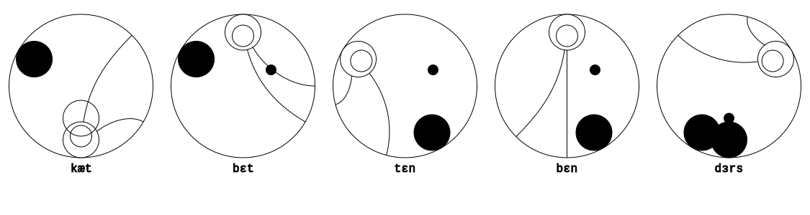

# Gallifreyan Translation Helper
###### by MightyFrong

This is an online tool aimed at artists and hobbyists who produce designs in one of the following types of Gallifreyan:
* [Sherman's Circular Gallifreyan by Loren Sherman][SCG]
* [TARDIS Console by Purple Emily][TCG]
* [Doctor's Cot by Brittany Goodman][DCG]
* [Circular Gallifreyan by Cat Bettenbender][CB]
* [CC Gallifreyan by gumex][CC]
* [DotScript by Rachel Sutherland][DS]
* [Gallifreyan Alphabet by Aaron Jay][ABB]
* [Gallifreyan Alphabet by Sarah "DarkIfaerie"][DF]
* [Old High Gallifreyan by bpjmarriott][BPJM]
* [Old High Gallifreyan by ODDISM][ODD]

Some details on what the translation helper for each system does can be found below:
* [Sherman's](#Shermans)
* [TARDIS Console](#TARDIS-Console)
* [Doctors's Cot](#Doctors-Cot)
* [cBettenbender's](#cBettenbenders)
* [CC Gallifreyan](#CC-Gallifreyan)
* [DotScript](#DotScript)
* [ArtByBoredom Gallifreyan](#ArtByBoredom)
* [DarkIfaerie's Gallifreyan](#Darkifaeries)
* [bpjmarriott's Old High Gallifreyan](#bpjmarriotts)
* [ODDISM's Old High Gallifreyan](#ODDISMs)

Please recognize this tool ***not*** as a translator: it serves the purpose of quicker impressions of writing syntax. The artistic composition is, and should be, your challenge. Please do not use any of these outputs for an immediate tattoo template!

---

## Abstract

See the [wiki](https://github.com/Mightyfrong/gallifreyan-translation-helper/wiki) for a high-level overview of the project. The rest of this documentation is planned to follow.

(All of) the supported systems generate an svg-output that can be saved by right-clicking and are hopefully useful to initiate artistic work within your vector-graphics-application.

## Sherman's

Primarily designed as a pattern memory aid, this module draws each character either as an individual glyph, or stacked depending on choice. It displays the words either in a circular fashion (not spiral though) or every glyph/group in horizontal lines for ease of reading.

One can optionally toggle whether C is transcribed to K/S in the language controls.

Numbers are supported, but only make sense with grouping enabled. Dot and comma both are valid decimal separators in number groups.

Diacritics are supported according to the [official guide][SCG] for german umlauts, accent acute, accent grave, ñ and scandinavian å, ø and æ.

Decorator lines do not connect anywhere at the moment. This is as well due to the fact we did not come up with a reasonable algorithm to accomplish that yet, as random straight lines are neither easy to read nor aesthetically appealing.

Supported characters are `[a-z0-9.?!"'-,;:éèíìüúùæäáàåöóòøñ]`, uppercase will be converted.

### What To Expect

### Test Input
`The quick brown fox jumps over the lazy dog.`

`Falsches Üben von Xylophonmusik quält jeden größeren Zwerg.`

`Voyez le brick géant que j'examine près du wharf.`

`El pingüino Wenceslao hizo kilómetros bajo exhaustiva lluvia y frío; añoraba a su querido cachorro.`

`Flygande bäckasiner söka hwila på mjuka tuvor.`

---

## TARDIS Console

Another approach was chosen to get this one finally running. TARDIS Console is heavily inspired by the shows artwork and therefore has huge tables of glyphs that have no simple pattern or system to style consonants and vowels. This style is not easily wrapped up to an algorithm. The glyps and paired vowels were redrawn in inkscape and will be resized and placed to the canvas.

Vowels are always attached to a consonant, leading or double vowels or these that come on the third place are accompanied by aleph.
Currently only the table of the guide part 1 is supported `[a-zא]`, punctuation and number are postponed ([the construction file is available](assets/tardisconsole.svg)).

### What To Expect

---

## Doctor's Cot

The progress of vectorizing all the things got a bit stuck for a few weeks and one of us wasn't able to understand and contribute to foreign code. So Doctor's Cot was straightforwand rebuild based on the coding style of CC-Gallifreyan. ɑ-based vowels are a bit impure regarding connectivity, but on the plus side there is canonical punctuation (except start indication).
Like in the original Cot-module there is an IPA-keyboard. Since the author has published a simplyfied english version as well there is a respective keyboard that translates the english characters to the IPA-characters according to the official tables.

Supported characters will be available on the provided keyboard.

### Example

---

## cBettenbender's

By time of implementing this writing system the instructions were still described as unfinished and surely felt a bit unclear. To make matters worse the initial publication was long time ago. Although the first page of the documentation describes the system as literal without phonetic replacements for consonants, some latin characters are missing, examples lead to other conclusions and vowels are most definetly described as phonetic. So after all there has to be a keyboard that limits allowed characters and inserts respective ipa-vowels. Grouping characters happens by syllables, but since putting this into an algorithm is currently beyond the ability of this helper you'll have to group by splitting character groupy by your own.

Some of the design choices are based on personal choice, contextual considerations, the few impressions from the guide and maybe lack of coding skills:
* *repetition indicators for vowels* are a thing in this interpretation. double vowels normally change the sound, probably leading to another glyph, but in case of names double vowels might be allowed
* *start indicators* for consonants and vowels will always attach to or be placed within the widest free section of the syllable circle. There's hope that this interferes the least but will surely do occasionally (**again: this is not a translator, just a helping aid for patterns!**). since the indicators will be random placed within their boundary maybe a re-render fixes it from time to time. the consonant indicator will never direct to opposing sides, but you'll get the spirit
* *consonant connectors* work for only two connected consonants, i am currently unaware in which scenario one syllable contains longer chains

Since the documentation is unfinished the GTH gives even less warranty for this module than for any others.

Supported characters will be available on the provided keyboard.

### What to expect

---

## CC Gallifreyan

This writing system feels like a hybrid from the look of TARDIS Console and the clear base-decorator-relations from Sherman's. This system processes the latin alphabet with th and ng only, no diacritics, punctuation or numbers.

Characters are simply stacked, while being read from outside to the center, but its up to the artist to decide about the number of stacked characters. This translation helper splits characters in words evenly to the set number. The maximum stacking amount is limited for easier reading, although the writing system itself is not clearly restricted in this context. Base- and decorator-graphics are tilted slightly to make it look less monotonous, yet orientated to one side to avoid problems from overlapping (this is just a programmatic necessity, not an artistic recommendation!).

Supported characters are `[a-z]`, uppercase will be converted.

### What to expect

---

## DotScript

This writing system may not be widely used but is quite easy and was quick and fun to program. Each character is assigned one of five geometric shapes that have a special placement regarding the base line for consonants and a smaller representation for vowels. The character `z` has it's own shape. This system of one distinct glyph for every character makes DotScript more of a font than a writing system. But implementing it was a useful experience.

Supported characters are `[a-z]`, uppercase will be converted.

### What To Expect

---

## ArtByBoredom

Like DotScript this system is more likely a font with geometric shapes representing latin alphabet letters. It is the first implemented gallifreyan distinguishing between upper- and lowercase characters. And like DotScript this is not a writing system per se but included for the sake of completeness and another coding exercise.

Supported characters are `[a-zA-Z.,:;-/"']` and if you say *but there are more punctuation characters* you most probably won't need this tool anyway.

### What To Expect

---

## DarkIfaerie's

With one glyph for every character of the english alphabet DarkIFaerie's gallifreyan is more or less another font. The small difference considering it a system is arranging the characters in a circle and reading clockwise.

Supported characters are `[a-z]`, uppercase will be converted.

### What To Expect

---

## bpjmarriott's

Old High Gallifreyan is not a circular font at all, but since it is a timelords script it still is considerable fitting in the translation helper. bpjmarriott's gallifreyan is supposed to be read from top to bottom.

Supported characters are `[a-z0-9.,!?":;']`, uppercase will be converted.

### What To Expect

---

## ODDISM's

Another Old High Gallifreyan thats not a circular font. It is the latest version and the successor of [FREAKISM's Old High Gallifreyan](https://freakism.tumblr.com/post/11577887916/im-proud-click-here-for-big-version-i-did) ([that is in fact the same author](https://freakism.tumblr.com/post/42112673388/so-i-just-found-your-old-high-gallifreyan)). According to the authors sources this font seems to be written from left to right. Or maybe the other way round, but this was the decision. This is a phonetic font - the original table has words as well as IPA-characters. Both are provided as keyboards, but the input will be filled with IPA-characters.

Supported characters will be available on the provided keyboard.

### What To Expect

---

## Copyright & Licence Notice

Copyright 2020 [Mightyfrong][MF], [erroronline1][EOL1], [ModisR][MR]
 
This file is part of the Gallifreyan Translation Helper,
henceforth referred to as "the GTH".

The GTH is free software: you can redistribute it and/or modify
it under the terms of the GNU General Public License as published by
the Free Software Foundation, either version 3 of the License, or
(at your option) any later version.

The GTH is distributed in the hope that it will be useful,
but WITHOUT ANY WARRANTY; without even the implied warranty of
MERCHANTABILITY or FITNESS FOR A PARTICULAR PURPOSE.  See the
GNU General Public License for more details.

You should have received a copy of the GNU General Public License
along with the GTH.  If not, see <https://www.gnu.org/licenses/>.

[MF]: https://github.com/Mightyfrong
[EOL1]: https://github.com/erroronline1
[MR]: https://github.com/ModisR

[SCG]: https://shermansplanet.com/gallifreyan/guide.pdf
[TCG]: https://tardisconsolegallifreyan.weebly.com/tutorials.html
[DCG]: https://doctorscotgallifreyan.com/walk-through/4lnekzojej4p5klcph0ppntibb19ib
[CB]: https://www.deviantart.com/cbettenbender/gallery/33798145/circular-gallifreyan
[CC]: https://www.deviantart.com/gumex/art/CC-Gallifreyan-458112363
[DS]: https://www.deviantart.com/rachelsutherland/gallery/58931409/dotscript-gallifreyan-guide
[ABB]: https://www.deviantart.com/artbyboredom/art/Gallifreyan-Alphabet-298046680
[DF]: https://www.deviantart.com/darkifaerie/art/Gallifreyan-Alphabet-270857268
[BPJM]: https://www.deviantart.com/bpjmarriott/art/Old-High-Gallifreyan-Alphabet-370087020
[ODD]: https://odd-things-happen.tumblr.com/post/21573543574/my-finished-gallifreyan-alphabet-i-think-im

[1]: https://developer.mozilla.org/en-US/docs/Web/SVG/Tutorial/Paths
[2]: https://en.wikipedia.org/wiki/International_Phonetic_Alphabet
